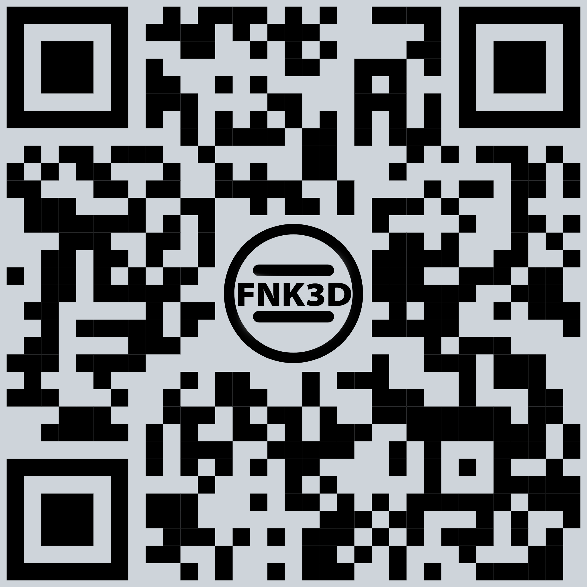

# Hi, I'm FNK3D 👋

I build interactive interfaces and small tools for creative work.

---

### 🚀 What I'm working on

- 💠 **[RECAP Builder](https://github.com/FNK3D/recap-builder)** — a standalone HTML widget for building portfolio grids: circle, diamond, 3×3 square, or shards. Exports to PNG, SVG, and HTML.

- 🖥️ [PC Specs](https://github.com/FNK3D/pc-specs) — a universal info card widget builder. 90+ SVG icons, drag & drop, RU/EN, custom accent colors. Exports as a single HTML file.

---

### 📱 All my links in one place

Point your phone camera at the QR code — it will take you to my [Taplink](https://taplink.cc/fnk3d) with all my links.

---

© 2026 FNK3D · Licensed under the MIT License
